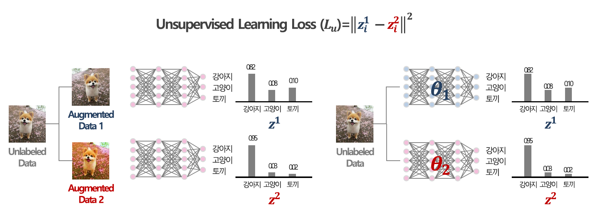
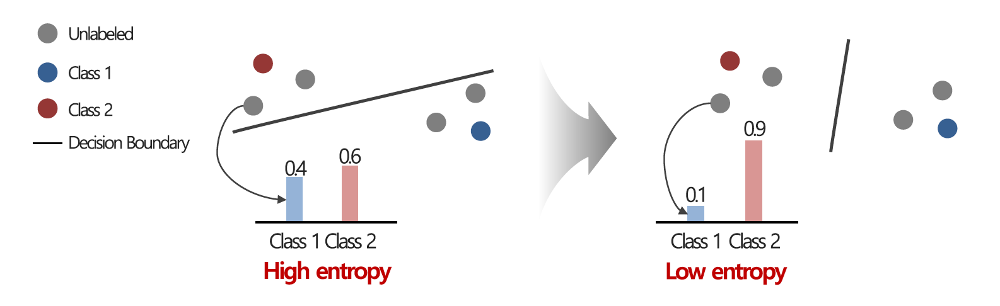
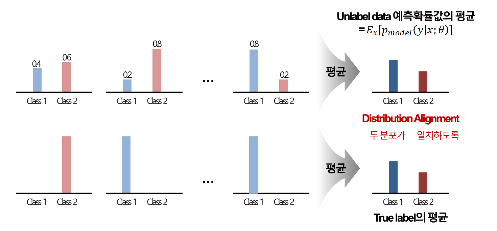
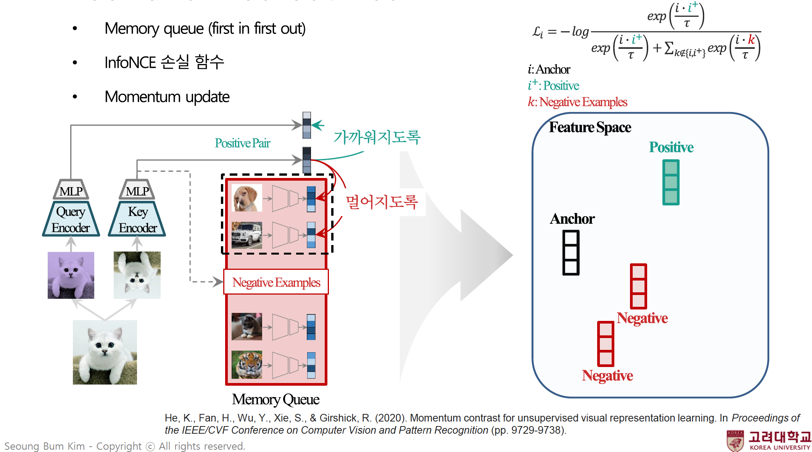
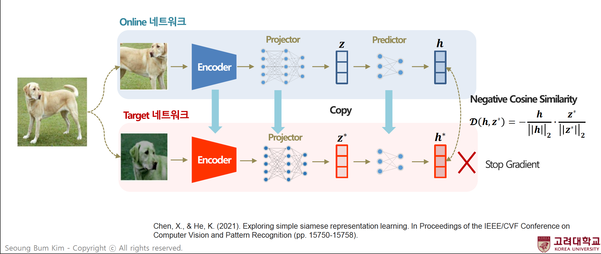

# The comparision analysis of learning methods based on CIFAR-10 Image dataset

## Motivation

본 Repository는 고려대학교 산업경영공학부 [김성범 교수님(Seoung Bum, Kim. Professor)](http://dmqa.korea.ac.kr/members/professor)의 2022년도 1학기 "다변량 통계분석 및 데이터마이닝(Multivariate Statistical Analysis for Data Mining)"수업의 학습 및 과제 수행 내용을 바탕으로 작성되었습니다. 해당 내용에 대한 학습과 과제 수행의 지도를 맡아주신 교수님께 감사의 말씀을 드립니다.

### Research Question
- from [Professor Seoung Bum, Kim.](http://dmqa.korea.ac.kr/members/professor)

```text
[Question]

X, Y가 모두 있는 오픈데이터를 이용하여 다음을 수행하시오(이미지, 시그널, 테이블 데이터 어떤 종류여도 상관없습니다).
일부 데이터의 레이블 (Y)을 지우고 semi-supervised learning 기법 최소 3가지, 
self-supervised learening 기법 최소 3가지,
그리고 supervised learning 방법론을 적용하고 성능을 비교하시오. 
더불어 도출된 결과에 대한 본인의 해석을 적으시오.  
```

---

## Introduction

본 Repository는 위의 ```Research Question```에 대한 답을 작성하기 위해 수행된 내용을 담고 있습니다. 해당 내용의 수행을 위해 아래와 같은 데이터(Dataset)와 방법론(methods)을 적용해 분석을 수행했습니다.


### Dataset
- [CIFAR-10](http://www.cs.toronto.edu/~kriz/cifar.html)

### The list of methods
- Supervised learning
    - ResNet18
- Semi-Supervised learning
    - [Mix Match(D Berthelot, 2019)](https://arxiv.org/abs/1905.02249)
    - [ReMix Match(D Berthelot, 2020)](https://arxiv.org/abs/1911.09785)
    - [Fix Match(Kihyuk Sohn, 2020)](https://arxiv.org/abs/2001.07685)
- Self-Supervised learniing
    - [MoCo(Kaiming He, 2019)](https://arxiv.org/abs/1911.05722)
    - [SimCLR(Ting Chen, 2020)](https://arxiv.org/abs/2002.05709)
    - [SimSiam(Xinlei Chen, 2021)](https://arxiv.org/abs/2011.10566)


---

## Results

CIFAR-10 데이터에 대한 분류 task의 실험 결과는 아래와 같습니다. 

'Test Accuracy'는 ```Semi_Supervised``` 방법론 적용 시, 각 class 별로 사용하는 labeled 샘플 수를 의미합니다. 

예를 들어 FixMatch 방법론에서 각 class 별로 4개의 labeled 샘플을 사용해 ```Semi_Supervised``` 학습을 진행한 경우, test accuaracy는 0.9269입니다. 

| Methods          | Model      | Test Accuracy (4, 25) |
|:----------------:|:----------:|:---------------------:|
| Semi_Supervised  | FixMatch   | (0.9269, 0.9516)      |
| Semi_Supervised  | RemixMatch | (0.9051, 0.9378)      |
| Semi_Supervised  | MixMatch   | (0.5930, 0.8692)      |
| Fully_Supervised | ResNet18   | 0.8231                |
| Self_Supervised  | SimCLR     | 0.8203                |
| Self_Supervised  | SimSiam    | 0.8140                |
| Self_Supervised  | Moco       | 0.8014                |


### Analysis

Semi supervised 접근의 각 방법론들이 supervised, self-supervised learning 대비 높은 평가 정확도를 보였다. 

Semi supervised 방법론의 각론을 살펴보면, FixMatch가 label 샘플 수에 따른 2가지 경우에서 모두 가장 높은 성능을 보였다. 그리고 MixMatch가 가장 낮은 성능을 보였다. Fix, Remix match와 Mix match간 가장 큰 차이점 중 하나로 바로 'strong augmentation'기법의 활용 여부를 고려할 수 있다. strong augmentation 기법의 적용 여부가 semi-supervision 시, 상대적으로 큰 영향을 미침을 유추해볼 수 있다. 더불어,FixMatch가 RemixMatch 대비 모두 높은 성능을 보였다. FixMatch와 RemixMatch 간 미묘하지만 다른 점 중 하나는 Storng augmentation을 적용한 unlabled 데이터의 guessed label 정의 과정이다. Weak augmentation 데이터에 대한 logit distribution에 기반해 guessed label을 정의한다는 것은 공통점으로 볼 수 있다. RemixMatch는 기본적으로 weak augmentation의 logit distribution의 sharpening된 분포를 strong augmentation의 guess labeling에 활용한다. 반면 FixMatch의 'augmentation anchoring'의 과정은 특정 threshold를 넘어서는 confident logit을 one-hot한 값으로 labeling을 진행한다. 이를 통해 FixMatch의 strong augmenataion 샘플의 guessed label은 더욱 높은 confident를 갖는 예측을 대상으로 만 진행되게 됨을 짐작할 수 있다. 이러한 augmentation anchoring에서의 미묘한 차이가 결과적으로 모델의 semi-supervision 학습 성능에 도움이 되었을 것으로 판단된다. 더불어 MixMatch의 경우 소량의 labeled 샘플(4개)을 사용할 경우, 성능이 매우 낮게 나타나는 것을 볼 수 있다. 하지만 labeled 샘플의 수를 조금만 늘려도(25개) 그 성능의 향상이 매우 큰 폭으로 나타남을 알 수 있다. Class 당 비교적 일정량 이상의 labeled 샘플이 존재할 경우, MixMatch 방법론 만으로도 충분히 좋은 성능을 확보할 수 있음을 유추할 수 있다.

Self supervised 방법론을 살펴보면, SimCLR 방법론이 가장 높은 성능을 보였다. Contrastive learning 알고리즘을 활용하는 SimCLR과 MoCo를 비교하면, SimCLR이 더욱 높은 성능을 보였다. SimCLR은 학습을 함에 있어 MoCo 보다 더욱 많은 양의 negative sample을 활용한다. 더불어 이러한 negative sample이 2개의 network를 통해 대조 학습되기 때문에, 이러한 요소가 근소하지만 MoCo보다 높은 성능을 갖게 하는 데 긍정적인 영향을 주었을 것으로 유추할 수 있다. 더불어 SimSiam도 SimCLR보다는 낮지만 좋은 성능을 보였다. SimSiam은 비 대조학습 방법론으로서 학습에 positive sample만 사용한다. negative sample이 없이 positive sample만으로도 좋은 성능을 보인 것은 주목할 만하다. 현재의 실험결과에는 [BYOL(Jean-Bastien Grill, 2020)](https://arxiv.org/abs/2006.07733)은 존재하지 않아, SimSiam 방법론의 성능을 직접적으로 비교해 SimSiam 방법론의 직접적인 이점 및 효과를 확인하기는 어렵다. 그럼에도 불구하고 positive pair만을 토대로 contrastive learning 방법론인 MoCo보다 높은 성능을 보인 것은 매우 주목할만하다.


### Logs and weights

- 아래의 Link를 통해 실험에서 사용한 모델을 다운받을 수 있습니다.
    - [Google drive](https://drive.google.com/drive/folders/1NfI84WwkwMIfjxJ_yEiig--hEATyyKXt?usp=sharing)
    

---

### Brief reveiw of methods

- **"All resources are from the Leture note of [Professor Seoung Bum, Kim.](http://dmqa.korea.ac.kr/members/professor)"**


#### Semi-Supervised learning

1. [Mix Match(D Berthelot, 2019)](https://arxiv.org/abs/1905.02249)

- 학습 데이터 구성에 있어 Consistency Regularization, Entropy Minimization, Mix-Up의 아이디어를 혼합해 사용하는 Semi-supervised 학습 방법

    - Consistency Regularization : 데이터, 모델에 변형을 주어 다르게 도출된 예측 값이더라도 같은 이미지에서 도출되었다면 비슷한 값을 갖도록 하는 제약 기법

        

    - Entropy Minimization : 레이블 간 Confidence의 차이를 최대화해 Entropy를 최소화하는 기법
        
        

    - Mix-Up : 2개의 데이터 샘플 간 선형 보간법을 통해 가중 평균된 새로운 데이터 샘플을 증강해내는 기법

- Weak augmentation 기법만 활용

2. [ReMix Match(D Berthelot, 2020)](https://arxiv.org/abs/1911.09785)

- 성능 개선을 위해 Mix Match 알고리즘에 'Distribution Alignment', 'Augmentation Anchoring' 2가지 아이디어를 추가한 방법론

    - Distribution Alignment : Unlabel 샘플에 대한 모델의 예측 logti의 평균 분포(distribution)가 true label의 평균 분포(distribution)가 서로 일치(alignment)하도록 유도하는 기법

        

    - Augmentation Anchoring : Strong augmentation 기법을 활용해 consistency regularization 효과를 더욱 강화해 활용하는 방법
        - Weak augmentation이 적용된 데이터의 예측 분포를 strong augmentation이 적용된 데이터의 target으로 활용

3. [Fix Match(Kihyuk Sohn, 2020)](https://arxiv.org/abs/2001.07685)

- Labeled 데이터는 weak augmentation을 적용해 학습
- Unlabeled 데이터는 Augmentation Anchoring을 활용해 weak augmentation과 strong augumentation을 모두 활용해 학습
    - Augmentation Anchoring : strong augmentation의 target은 weak augmentation의 'confident가 높은' 예측분포의 one-hot으로 변경한 값으로 설정


#### Self-Supervised learning
            
1. [MoCo(Kaiming He, 2019)](https://arxiv.org/abs/1911.05722)
    
- Positive pair와 negative example 개념을 정의해 대조 학습(contrastive learning)을 수행하는 방법론

    

- 효과적인 대조학습을 수행하기 위해, 아래의 3가지 방법을 제시
    - Memory Queue(First in, First out)
    - InfoNCE loss function
    - Momentum update


2. [SimCLR(Ting Chen, 2020)](https://arxiv.org/abs/2002.05709)

- Negative example 획득 방식에 새로운 방식을 가미해, 대조 학습(contrastive learning)을 수행하는 방법론
    
    - 모델의 데이터 학습에 더욱 깊은 다층 퍼셉트론을 활용
    - MoCo와 달리, 2개의 신경망 층을 활용해 대조 학습 수행
        - 데이터의 augmentation(crop, color change 등)을 학습에 활용
    - 대조 학습에서 중요한 역할을 하는 negative example의 수를 더욱 많이 활용하도록 설정
        - 반대급부로 학습의 비용(시간, 메모리)는 확대

3. [SimSiam(Xinlei Chen, 2021)](https://arxiv.org/abs/2011.10566)

- MoCo, SimCLR 같은 대조 학습 방법론 달리 positive pair만 고려해 학습
- Online network, Target network로 2개의 network 구조를 병렬적으로 구성해 학습 진행

    

- 일정 학습 주기마다, Online network의 가중치를 그대로 복사해 target network의 가중치를 update